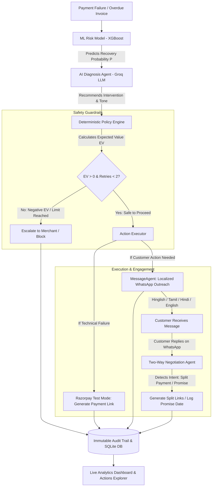

# 🚀 RecoverAI: Autonomous Revenue Recovery Agent

> **An intelligent, policy-bounded AI agent that detects revenue at risk, predicts recovery probability with Machine Learning, negotiates solutions via two-way conversational AI, executes recovery actions via Razorpay, and proves recovered capital with an auditable trail.**

[](https://fastapi.tiangolo.com)
[](https://xgboost.readthedocs.io/)
[](https://groq.com/)
[](https://razorpay.com)
[](https://tailwindcss.com)
[](https://vuejs.org)

---

## 📌 Executive Summary

Every year, digital merchants lose **2% to 5% of their Gross Merchandise Value (GMV)** to payment failures, abandoned checkouts, and overdue invoices. Traditional recovery methods are fundamentally broken:
- **Dumb Automated Retries:** Gateways blindly retry failed cards, racking up punitive gateway penalty fees and annoying customers.
- **Static Template Blasts:** Impersonal *"Payment Failed"* emails get ignored or sent to spam.
- **Expensive Manual Outreach:** Human support teams cost thousands of dollars and cannot scale 24/7.
- **The "AI Trust" Problem in Fintech:** Pure LLM bots cannot be trusted in payments because hallucinations could grant unauthorized discounts or spam customers indefinitely.

**RecoverAI** solves this by fusing **Machine Learning risk prediction**, **LLM diagnosis & localized communication**, and a **Deterministic Safety Policy Engine** that mathematically bounds every action. When customers reply via WhatsApp (e.g. *"I don't have the full amount"*), an autonomous **Negotiation Agent** steps in to offer split payment installments or track promises to pay—turning lost revenue into captured revenue with zero human intervention.

---

## 💡 Why This Project Is Important (Business Impact)

| Traditional Dunning Systems | RecoverAI Autonomous Agent |
| :--- | :--- |
| **Fixed Time Retries:** Retries after 1hr/24hr regardless of failure reason. | **Context-Aware Decisions:** Differentiates bank timeouts from insufficient funds. |
| **Blind Execution:** Retries even if recovery probability is 2%, wasting gateway fees. | **Expected Value (EV) Guardrails:** Only executes actions with positive mathematical ROI. |
| **Monolingual Email Templates:** Generic, cold English emails with low click-through. | **Hyper-Personalized Multi-Lingual Messaging:** Native Hinglish, Tamil, Hindi, and English WhatsApp outreach. |
| **One-Way Broadcast:** If a customer can't pay today, the payment churns forever. | **Two-Way Negotiation:** Interactive AI splits bills into installments or schedules follow-ups. |
| **Black Box / No Audit Trail:** Difficult to measure what worked or why a user was contacted. | **Complete Audit Log:** Every probability, diagnosis, and policy check is permanently logged. |

---

## 🏗️ Architecture & Workflow

RecoverAI combines a 4-tier pipeline ensuring speed, intelligence, compliance, and deterministic execution:



### The Expected Value (EV) Decision Rule
RecoverAI will never execute an action that loses money for the merchant. The **Policy Engine** deterministically calculates:

$$\text{Expected Value (EV)} = (\text{Transaction Amount} \times P_{\text{recovery}}) - \text{Action Cost}$$

* If $\text{EV} \le 0$, the action is **blocked** to save merchant operational costs.
* If attempts $\ge 2$, retries are blocked to prevent card network penalties.
* If transaction amount $\ge ₹50,000$, the agent requires human authorization.

---

## ✨ Key Features

### 1. 🧠 Machine Learning Risk Model (XGBoost)
* Trained on synthetic transactional telemetry data (`recovery_events.csv`).
* Evaluates 11 features: transaction amount, payment method, customer segment, days since failure, attempt count, historical success rate, customer lifetime value (CLV), subscription status, and invoice age.
* Outputs calibrated **Recovery Probability (0.0 to 1.0)** fed into the agent brain.

### 2. 🤖 Diagnosis & Reasoning Agent (Groq / LLaMA 3.3)
* Synthesizes the failure reason, customer value, and ML probability.
* Reasons whether to retry immediately, contact the customer, offer alternative methods, or hold off.
* Explains its internal logic in plain English for merchant review.

### 3. 🛡️ Deterministic Safety Policy Engine
* Zero-hallucination guarantee. The LLM only proposes an action; the policy engine has veto power.
* Enforces strict retry ceilings (max 2 retries), communication caps (max 2 messages), and EV thresholds.

### 4. 🌐 Multi-Lingual Auto-Translation (Localized Messaging)
* Automatically crafts messages tailored to the customer's preferred language:
  * **Hinglish:** *"Hi Ravi, aapka ₹2,417 ka payment bank timeout ki wajah se fail hua hai. Ek click se dobara pay karein: [LINK]"*
  * **Tamil:** Native script personalized message explaining failure and providing link.
  * **Hindi:** Formal Devnagari Hindi outreach for enterprise/rural customers.
  * **English:** Professional standard dunning message.

### 5. 💬 Two-Way AI Negotiation Agent (WhatsApp Simulator)
* Real-time conversational AI handles customer responses:
  * **Installment Negotiation:** Customer replies *"I don't have the full amount, can I pay half?"* $\rightarrow$ Agent detects `request_split`, generates an installment payment link, and splits the bill into 2 equal parts.
  * **Promise to Pay:** Customer replies *"I will pay tomorrow"* $\rightarrow$ Agent detects `promise_to_pay`, stores the date, halts reminder cadences, and monitors for settlement.
  * **General Queries:** Answers customer questions about why a transaction was declined.

### 6. 📊 Real-Time Analytics Dashboard & Actions Explorer
* Live **Chart.js** metrics: Revenue at Risk, Recovered Revenue, Success Rate, and Agent Action breakdown.
* **Interactive Breakdown Modal:** Click the Agent Actions card or any doughnut chart slice to view all touched payments categorized into:
  * ✅ **Recovered & Restored**
  * 💬 **In Negotiation**
  * 📩 **Reminders Sent**
  * ⚠️ **Escalated / Blocked**
* **Audit Trail Viewer:** Deep-dive inspection page showing the timeline, ML probability, LLM reasoning, policy verdicts, and customer WhatsApp chat simulation.

---

## 🛠️ Technology Stack

| Layer | Technology | Purpose |
| :--- | :--- | :--- |
| **Backend API** | Python 3.11+, FastAPI, Uvicorn | High-performance asynchronous REST API & Webhooks |
| **Database & ORM** | SQLite, SQLAlchemy 2.0 | Transaction records, audit trails, negotiation state |
| **Machine Learning** | XGBoost, Scikit-learn, Pandas, Joblib | Recovery probability estimation & feature engineering |
| **Agentic AI & LLMs** | LangChain Core, ChatGroq, LLaMA-3.3-70b-versatile | Diagnosis reasoning, translation, and chat negotiation |
| **Payment Gateway** | Razorpay Python SDK (Test Mode) | Dynamic payment link generation & webhook handling |
| **Frontend** | Jinja2, Vue.js 3 (Composition API), Tailwind CSS | Reactive, component-driven dashboard & modals |
| **Data Visualization**| Chart.js | Revenue metrics and doughnut breakdown charts |
| **Package Tooling** | `uv` (Astride Python package manager) | Blazing-fast virtual environment and dependency lock |

---

## ⚡ Quick Start Guide

### Prerequisites
* Python 3.11 or higher installed
* [uv](https://github.com/astral-sh/uv) installed (recommended) or standard `pip`
* A free [Groq API Key](https://console.groq.com/) for LLM inference

### 1. Clone the Repository
```bash
git clone https://github.com/Anurag-334/recoverai.git
cd recoverai
```

### 2. Configure Environment Variables
Create a `.env` file in the root directory:
```env
# Groq API Key (for LLM Reasoning & Messaging)
GROQ_API_KEY=gsk_your_groq_api_key_here
LLM_MODEL=llama-3.3-70b-versatile

# Database (Default SQLite)
DATABASE_URL=sqlite:///./recoverai.db

# Razorpay Test Mode Keys (Optional: leaves empty to use graceful simulation links)
RAZORPAY_KEY_ID=
RAZORPAY_KEY_SECRET=
```

### 3. Install Dependencies
Using `uv`:
```bash
uv sync
```
*(Or with pip: `pip install -e .`)*

### 4. (Optional) Re-train the Machine Learning Model
The repository includes a pre-trained model in `models/model.joblib`. To re-train it on the synthetic dataset:
```bash
uv run python -m app.ml.train
```

### 5. Start the Application
Run the FastAPI development server:
```bash
uv run python -m uvicorn app.main:app --reload --port 8000
```
Open your browser and navigate to:
👉 **[http://localhost:8000](http://localhost:8000)**

---


## 🔮 Future Growth & Roadmap

RecoverAI is architected to scale from a hackathon prototype into a standalone B2B Fintech SaaS:

```
                  ┌────────────────────────────────────────────────────────┐
                  │                 RecoverAI Strategic Vision             │
                  └───────────────────────────┬────────────────────────────┘
                                              │
         ┌────────────────────────┬───────────┴────────────┬────────────────────────┐
         ▼                        ▼                        ▼                        ▼
┌──────────────────┐    ┌──────────────────┐    ┌──────────────────┐    ┌──────────────────┐
│  Multi-Channel   │    │  Reinforcement   │    │   Live Gateway   │    │   Subscription   │
│   Orchestration  │    │  Learning (RL)   │    │  Event Streaming │    │  Smart Retention │
└──────────────────┘    └──────────────────┘    └──────────────────┘    └──────────────────┘
```

### 1. Multi-Channel Autonomous Orchestration
* **AI Voice Calls (ElevenLabs + Twilio):** High-value B2B invoices ($> ₹25,000$) trigger human-sounding voice agents that politely clarify payment issues and offer IVR card payments on the phone.
* **Cascading Cadences:** Dynamic channel-switching: WhatsApp $\rightarrow$ SMS after 4 hours $\rightarrow$ Rich Interactive Email after 24 hours.

### 2. Reinforcement Learning from Payment Outcomes (RLHF / Bandits)
* Currently, the XGBoost model operates on pre-collected historical data.
* **Next Step:** Implement contextual multi-armed bandit algorithms. Every time a customer pays after an intervention, the agent rewards that specific message tone, discount level, or retry delay, continuously optimizing GMV recovery rates.

### 3. Live Webhook Event Streaming
* Direct integration with Razorpay Webhooks (`payment.failed`, `order.paid`, `invoice.expired`).
* Near-instant sub-second recovery triggers: an abandoned checkout or bank timeout can trigger a WhatsApp cart recovery link within 30 seconds.

### 4. Subscription Smart Retention & Pause Mechanics
* When recurring SaaS mandates fail repeatedly, instead of canceling the account, the agent automatically offers a 30-day billing pause or temporary tier downgrade, cutting customer involuntary churn to near zero.

### 5. Multi-Tenant Merchant Portal
* Single-click Shopify, WooCommerce, and Razorpay App Store plugins.
* Configurable merchant policy settings: merchants set their own minimum EV thresholds, maximum discount bounds, and tone of voice.

---

## 🔒 Security, Privacy & Compliance

* **No Financial Hallucinations:** All monetary calculations, links, and limits are verified by deterministic Python logic before any message is sent.
* **Masked Sensitive Data:** Payment identifiers are tokenized; no raw credit card numbers or banking passwords are ever ingested or passed to the LLM.
* **Audit Immutability:** Audit trail records maintain timestamps, agent recommendations, and policy decisions for compliance audits (SOC2 / PCI-DSS friendly).

---

## 👥 Authors & Acknowledgments

* **RecoverAI Team** — Built with passion for autonomous agentic systems, fintech infrastructure, and solving real merchant problems.
* Special thanks to the teams behind **Razorpay**, **FastAPI**, **LangChain**, **Groq**, and **XGBoost**.

---

<p align="center">
  <sub>Built with ❤️ for the AI Revenue Recovery Hackathon</sub>
</p>
